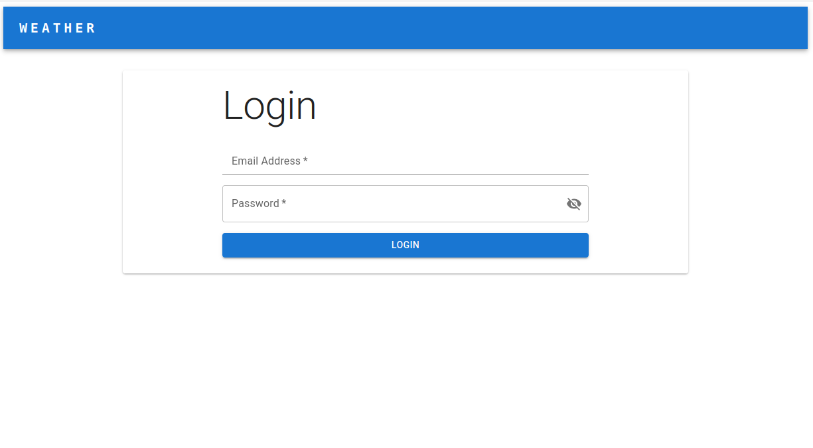

# Weather App

Este proyecto consta de dos aplicaciones:
- **weather-service**: Backend en Ruby on Rails con PostgreSQL y Redis.
- **weather-webapp**: Frontend en React con Vite y TypeScript.



## Requisitos
Asegúrate de tener instalados los siguientes requisitos antes de continuar:
- Node.js 18+
- npm 9+

---

## Instalación y ejecución del frontend (`weather-webapp`)

1. **Clonar el repositorio**
   ```sh
   git clone https://github.com/sergiohdezchi/weather-webapp.git
   cd weather-webapp
   ```

2. **Instalar dependencias**
   ```sh
   npm install
   ```

3. **Configurar variables de entorno**
   Crea un archivo `.env` en la raíz del proyecto y define las variables necesarias, por ejemplo:
   ```sh
    VITE_BACKEND_URL="http://localhost:3000/api/v1"
    VITE_CLIENT_ID="Q8dKTGKhgXfr-t8F-a6dSzOGtXqcvu6YlzT_b2BB23I"
    VITE_CLIENT_SECRET="CSkzwaRzNxs7uc0-zU_xWHeCaRQvNmSd5ubTAkM3ZqM"
   ```

4. **Ejecutar la aplicación**
   ```sh
   npm run dev
   ```

El frontend estará disponible en `http://localhost:5173`

5. **Iniciar Session**
   Para iniciar session puede ser con las siguientes credenciales
   ```sh
   email: admin@example.com
   password: 123456ab
   ```
---

## Notas adicionales
- Asegúrate de configurar y correr el backend.

Si tienes problemas, revisa los logs de cada servicio o ejecuta los comandos con más verbosidad (`npm run dev --verbose`).

## Notas sobre IA
Durante la elaboración de este proyecto, se utilizaron herramientas de inteligencia artificial para optimizar el proceso de desarrollo:

- GitHub Copilot fue de gran utilidad para la generación de código, sugerencias de sintaxis y autocompletado en diversas secciones del proyecto.
- ChatGPT fue empleado principalmente para resolver problemas de configuración, depuración de errores y obtención de explicaciones técnicas en distintos contextos del desarrollo.

El uso de estas herramientas permitió acelerar el desarrollo y mejorar la eficiencia en la escritura de código y configuración del entorno. Sin embargo, todas las decisiones finales fueron revisadas y validadas manualmente para garantizar la calidad y coherencia del código.